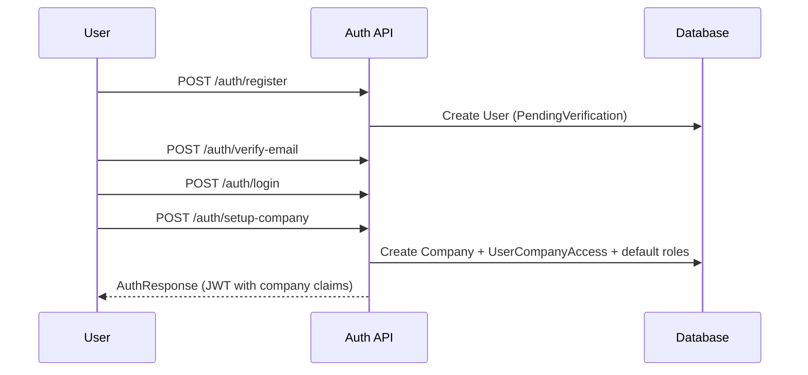

# Tenancy & companies

AssetMate Pro isolates data at two levels:

<ResponseField name="AccountId" type="uuid" required>
  Tenant root on every `TenantEntity`. Set automatically from the authenticated principal. Used for cross-company account isolation.
</ResponseField>

<ResponseField name="CompanyId" type="uuid" required>
  Operating company on assets, tickets, POs, devices, sites, etc. The active company comes from the JWT after login / switch.
</ResponseField>

## Company setup flow

## Switching companies

`GET /api/v1/auth/my-companies` lists accessible companies.  
`POST /api/v1/auth/switch-company` issues a new JWT for the selected `companyId`.

## Soft delete

All `BaseEntity` subtypes use `IsDeleted` with a global EF query filter. Hard deletes are rare (some master merges, device revocation side-effects).
