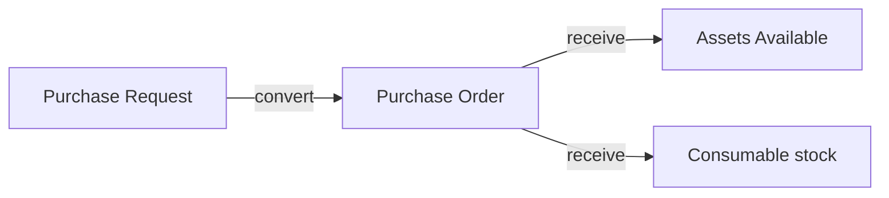

# Purchase & procurement overview

v1 ships **PR + PO + receive + documents**. RFQ is not implemented.

```mermaid
flowchart LR
  PR[Purchase Request] -->|convert| PO[Purchase Order]
  PO -->|receive| Assets[Assets Available]
  PO -->|receive| Stock[Consumable stock]
```

Permissions under `purchase.*`. APIs: `/api/v1/PurchaseRequest`, `/api/v1/PurchaseOrder`.
