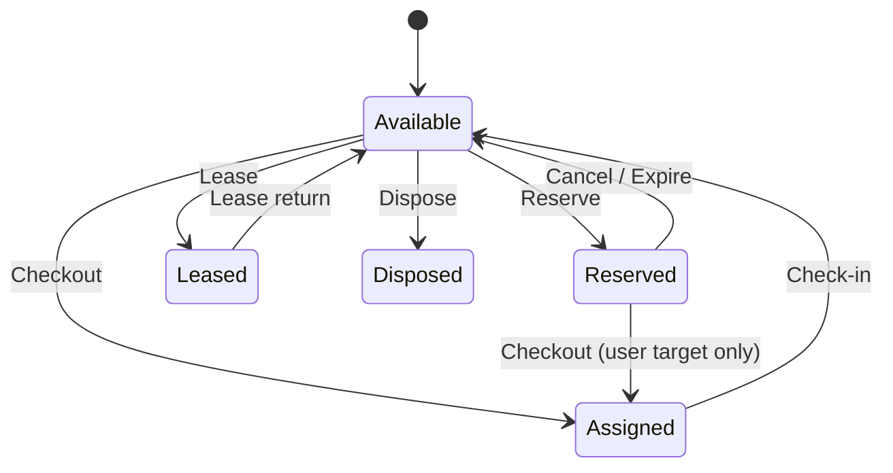

# Primary status state machine

## States

| Status | Meaning |
|--------|---------|
| `Available` | In stock; eligible for checkout / lease / reserve / dispose |
| `Assigned` | Checked out to user or location |
| `Leased` | On active operational lease-out |
| `Reserved` | Held by active reservation |
| `Disposed` | Terminal for operations |
| `Maintenance` | Enum exists; **current WO flow does not set this** |

## Orthogonal flag

`InMaintenance` (+ `MaintenanceSince`) overlays any primary status. It blocks reserve/dispose and is cleared when no Open/InProgress work orders remain.

<Warning>
Do not document maintenance as flipping `PrimaryStatus` to `Maintenance`. Work orders toggle `InMaintenance` only.
</Warning>
